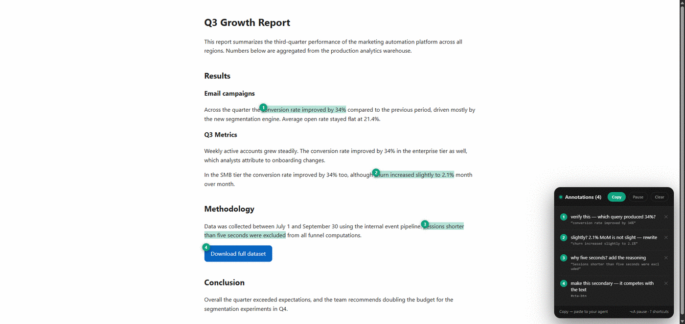

<div align="center">

# browser-annotations

**Point at a page. Say what's wrong. Paste it to your AI coding agent.**

Click an element to note a **design** change. Select text to note a **content** question.
Copy → paste. Every note carries the exact anchor your agent needs to find that thing in your source.

No account. No server. Nothing leaves your browser.


</div>

---

## The problem

Your agent writes UI it can't see, and writes content it can't fact-check. So you squint at the browser
and type a paragraph back — *"the CTA's too big, move it left, wrong green"*, *"where does that 34% come
from?"* Slow, vague, and the agent still has to guess which element or sentence you meant.

**Point at the real page instead.** Two gestures, no mode to switch:

| Gesture | Note kind | For | Anchored by |
|---|---|---|---|
| **Click an element** | 🟢 Design | *"make this green", "move it left"* | source file:line (dev build), else `data-testid` / `id` / text |
| **Select a run of text** | 🔵 Content | *"verify this number", "expand this"* | the quote itself + surrounding context + heading path |

<div align="center">

</div>

## Install (30 seconds)

Not on the Chrome Web Store yet, so load it by hand:

1. Download this repo (green **Code** button → **Download ZIP**, then unzip) — or `git clone` it.
2. Open **`chrome://extensions`** and turn on **Developer mode** (top-right toggle).
3. Click **Load unpacked** and pick the **`extension/`** folder — *that subfolder, not the repo root.*
4. Pin **browser-annotations** to your toolbar so it's one click away.

To update later: `git pull`, then hit **Reload** on the extension card.

## Use it

1. **Turn it on** — toolbar button or **Alt+Shift+A**. The icon shows a green ●.
2. **Annotate** — click an element, or select text. Type the note, hit **Save** (⌘/Ctrl+Enter).
   The note box shows which kind you're writing (**DESIGN** / **CONTENT**) and drags by its header
   if it covers something. Mix both kinds freely on one page.
3. **Copy** — **Copy** button or **Alt+Shift+C**, then paste into your agent.
4. Turn it off when done. Notes are saved per page and come back next time you turn it on.

Works on any normal web page. (Not on `chrome://` pages, the Web Store or PDFs — you'll see a red `!`.)

### Shortcuts

| Key | What it does |
|---|---|
| **Alt+Shift+A** | turn the overlay on / off |
| **Alt+Shift+C** | copy all notes (ready to paste) |
| **Alt+A** | pause / resume capture (clicks pass through while paused) |
| **Alt+Shift+X** | clear all notes (asks first) |
| **⌘/Ctrl+Enter** | save the note · **Esc** to cancel |

The panel's **? shortcuts** link shows the same list. If **Alt+A** does nothing, Chrome left it
unassigned — that link opens `chrome://extensions/shortcuts` where you can set it.

## What your agent gets

**Design note** — how to find the element, then your change and the current styles:

```markdown
## [#2] make this the primary button — brand green
source: src/components/Cart.tsx:48  <CheckoutButton>
`<button class="btn" data-testid="checkout" type="submit">`  — text: "Place order"
label: "Place your order"
instance: 2 of 3 matching button.btn
dom-path (positional fallback): `main > form > button` · box 180x44 @640,520 · css fontSize:15px fontWeight:600 padding:12px 20px borderRadius:8px
```

- **Dev build?** Your agent opens `src/components/Cart.tsx:48` directly — no searching.
- **Otherwise** it searches `data-testid="checkout"` / `"Place order"`; **instance** ("2 of 3") says
  which copy you meant when an element repeats.
- The **css** line is the before-state, so *"make the padding smaller"* has a starting point.

**Content note** — the quote, its context and where it sits, so the agent greps the content source:

```markdown
## [#3] verify this number — what is the data source?
> "conversion rate improved by 34%"
section: Q3 Growth Report > Results > Email campaigns
context: …Across the quarter the«quote»compared to the previous period…
block: `<p id="p-email">` · dom-path: `#p-email`
```

The `context` line disambiguates a phrase that repeats on the page, and the export tells the agent to
**answer / verify / fix / expand per note** rather than restyle anything.

## How it works

- **Anchors, not coordinates.** Design notes read the framework's own debug info for a file and line
  (React / Next, Vue, Svelte, Angular dev builds), and otherwise pick the best greppable string
  (`data-testid` › `id` › visible text). Build-hashed class names are detected and ignored.
- **Content notes use a quote, not a DOM path** — quote + prefix/suffix, the same
  [W3C TextQuoteSelector](https://www.w3.org/TR/annotation-model/#text-quote-selector) idea behind
  Chrome's `#:~:text=` links. That survives re-renders and is greppable in your markdown or HTML source.
- **Highlights don't touch your DOM** — the selection is painted with the
  [CSS Custom Highlight API](https://developer.mozilla.org/en-US/docs/Web/API/CSS_Custom_Highlight_API),
  so nothing is wrapped, injected or reflowed inside the page's own markup.
- **Notes persist per route** in `localStorage` and re-resolve on reload; in single-page apps they
  re-key on `pushState` / `popstate` so they never save under the wrong path.
- **One file, no build.** ~45 KB of plain JavaScript, no framework, no bundler, CSP-safe. Paste
  `extension/bh-annotate.js` into DevTools and it works without the extension at all.

## Browser support

| Browser | Extension | Content-note highlights |
|---|---|---|
| **Chrome** 102+ | ✅ | ✅ 105+ |
| **Edge** 102+ | ✅ | ✅ 105+ |
| **Brave / Opera / Arc** (Chromium) | ✅ | ✅ |
| **Firefox** | ❌ not yet — [roadmap](ROADMAP.md) | API ships in 140+ (overlay via console paste, untested) |
| **Safari** | ❌ not yet — [roadmap](ROADMAP.md) | API ships in 17.2+ (overlay via console paste, untested) |

Below those highlight versions everything still works — the quote just isn't painted on the page.

## Privacy & permissions

Nothing is collected, nothing is sent anywhere, no remote code is loaded. Notes live in your browser's
`localStorage` and only leave it when *you* press Copy. Four permissions, all needed:
`activeTab` (reach the tab you're on) · `scripting` (inject the overlay) · `storage` (remember on/off
per tab) · `clipboardWrite` (the copy shortcut). No host permissions — no access to any site until
you switch it on. See [PRIVACY.md](PRIVACY.md).

## More

[Changelog](CHANGELOG.md) · [Roadmap](ROADMAP.md) · [Privacy](PRIVACY.md)

## License

[MIT](LICENSE) © kuzmany
